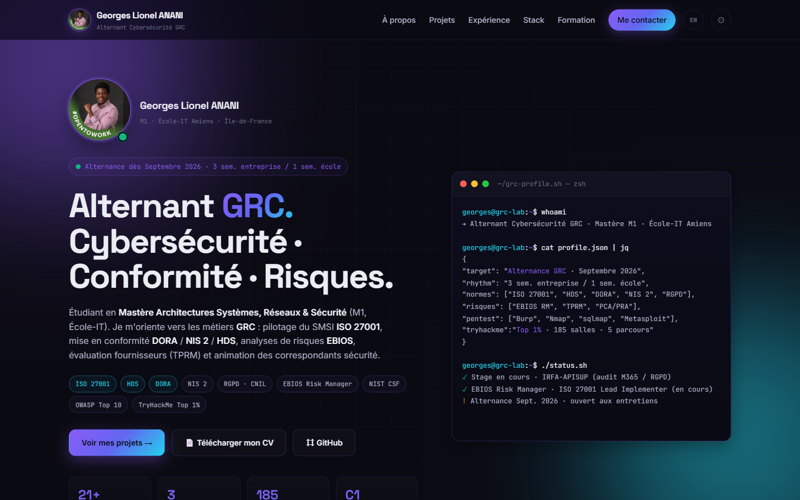
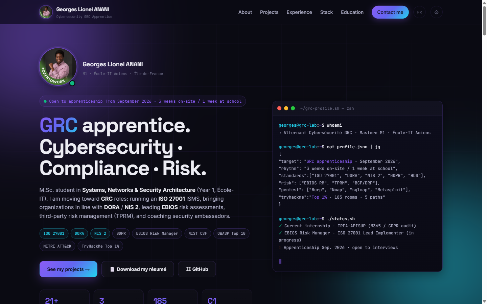

# Mon_Portfolio — Georges Lionel ANANI

> Portfolio full-stack **React + FastAPI** pour un **Alternant Cybersécurité GRC** (Gouvernance, Risques & Conformité).
> Page publique bilingue FR/EN + back-office d'administration JWT. CV PDF téléchargeable, design premium dark-tech, livrables GRC open-source.

[](https://github.com/AGL2304/Mon_Portfolio/actions/workflows/ci.yml)
[](#-stack)
[](LICENSE)
[](SECURITY.md)

---

## 🌐 Démo en ligne

- 🌍 **Site** (FR/EN switch dans la nav) — _déploiement à venir_ → `https://portfolio.agl-anani.dev/`
- 🧪 **Admin** — _déploiement à venir_ → `https://portfolio.agl-anani.dev/admin/login`
- 📂 **Livrables GRC** — _déploiement à venir_ → `https://portfolio.agl-anani.dev/grc/`

> 💡 Les URLs ci-dessus sont des **placeholders** : remplacer par l'URL Vercel / Cloudflare Pages après déploiement.

| Hero français | Hero anglais |
|---|---|
|  |  |

> ℹ️ Les screenshots ci-dessus illustrent le design (la nouvelle app React utilise le même CSS et le même hero — bascule FR↔EN désormais native, sans rechargement).

---

## 🎯 Aperçu

Ce repo héberge **deux livrables complémentaires** :

1. **Une stack React + FastAPI complète** (dossiers `frontend/` et `backend/`) avec :
   - Site public **bilingue FR / EN** (toggle sans rechargement, persisté en `localStorage`)
   - Interface d'administration **JWT** pour éditer profil / projets / expériences / compétences à chaud
   - Section **GRC** intégrée pointant vers les livrables `/grc/`
2. **Dossier [`grc/`](grc/)** — livrables types Gouvernance Risques & Conformité (matrice ISO 27001 Annexe A, template EBIOS RM, registre RGPD, modèle PSSI) — open-source, MIT.

| Composant | Cible | Quand l'utiliser |
|---|---|---|
| App React + FastAPI | Visiteurs · recruteurs · édition à chaud | Production |
| Livrables GRC (`grc/`) | Recruteurs, étudiants, PME sans RSSI | Réutiliser comme socle de mission |

---

## 🧱 Stack

- **Frontend** : React 18 + TypeScript + Vite + CSS modulaire · **i18n maison** (FR/EN, sans dépendance externe)
- **Backend** : FastAPI + SQLAlchemy + PostgreSQL (SQLite en tests) + JWT
- **Conteneurisation** : Docker + Docker Compose · nginx sert React + `/grc/` + `/assets/` + proxy `/api/`
- **CI/CD** : GitHub Actions (`.github/workflows/ci.yml`) · GitLab CI miroir (`.gitlab-ci.yml`)
- **Tests** : `pytest` (backend) · `vitest` (frontend unitaire) · **Playwright** (E2E)
- **Qualité** : `ruff` (Python) · `eslint` + `prettier` (TS/JS) · `pre-commit` + `gitleaks`
- **SEO** : JSON-LD `Person` + `ProfilePage` · OpenGraph + Twitter Cards · favicon SVG dégradé · meta `lang` dynamique
- **Déploiement** : Vercel (frontend) · Railway (backend) — config présente
- **Sécurité** : voir [SECURITY.md](SECURITY.md) pour la politique de divulgation responsable

```
.
├── assets/                       # statiques (photo, CV, favicon, screenshots)
│   ├── profile.jpg
│   ├── favicon.svg               # logo dégradé violet→cyan
│   ├── screenshots/              # captures pour README
│   ├── CV_Georges_Lionel_ANANI_GRC.pdf
│   └── CV_Georges_Lionel_ANANI_GRC_complet.pdf
├── backend/                # FastAPI + SQLAlchemy + JWT
│   ├── app/
│   │   ├── main.py         # routes API
│   │   ├── seed_data.py    # contenu par défaut
│   │   ├── models.py       # SQLAlchemy
│   │   ├── schemas.py      # Pydantic
│   │   └── security.py     # JWT, hashing
│   ├── tests/              # pytest
│   ├── pyproject.toml      # ruff config
│   ├── Dockerfile
│   └── requirements.txt
├── frontend/               # React 18 + TS + Vite
│   ├── src/
│   │   ├── pages/          # HomePage, AdminDashboardPage, AdminLoginPage
│   │   ├── components/     # ProjectCard, ProtectedRoute, Terminal, Toast
│   │   ├── context/        # AuthContext, LanguageContext
│   │   ├── i18n/           # translations.ts (dictionnaire FR + EN typé)
│   │   ├── services/       # API client
│   │   └── styles/         # global.css
│   ├── e2e/                # tests Playwright
│   ├── Dockerfile          # build context = racine du repo
│   ├── eslint.config.js
│   └── nginx.conf
├── grc/                    # livrables GRC publics (ISO 27001, EBIOS RM, RGPD, PSSI)
│   ├── README.md
│   ├── iso-27001-control-matrix.{md,csv}
│   ├── ebios-rm-template.md
│   ├── registre-traitements-rgpd.csv
│   └── pssi-modele.md
├── PROFILE_README.md       # README à copier vers AGL2304/AGL2304
├── LICENSE                 # MIT
├── SECURITY.md             # politique de divulgation responsable
├── docker-compose.yml
├── .pre-commit-config.yaml # hooks lint + secrets scanner
├── .github/workflows/      # CI GitHub Actions
└── .gitlab-ci.yml          # miroir GitLab
```

---

## ⚡ Démarrage rapide

### Option A — Stack complète avec Docker Compose (recommandé)

```bash
cp .env.example .env
# édite ADMIN_EMAIL, ADMIN_PASSWORD, JWT_SECRET, POSTGRES_PASSWORD
docker compose up --build
```

- 🌐 **Site** : http://localhost:3000 (clic sur `EN` dans la nav pour basculer en anglais)
- 📂 **Livrables GRC** : http://localhost:3000/grc/ (listing nginx)
- 🔌 **API** : http://localhost:8000/api
- 🔐 **Admin** : http://localhost:3000/admin/login

### Option B — En local sans Docker

**Backend**

```bash
cd backend
python -m venv venv
source venv/bin/activate            # Linux/macOS
# venv\Scripts\activate              # Windows
pip install -r requirements.txt
uvicorn app.main:app --reload --port 8000
```

**Frontend**

```bash
cd frontend
npm install
npm run dev          # http://localhost:5173
```

---

## 🌍 Internationalisation (FR / EN)

L'app React expose un **toggle FR ↔ EN** dans la nav. Le clic :

- Bascule **instantanément** toute l'UI (nav, titres de section, filtres, terminal, section GRC, contact, footer)
- Met à jour `<html lang="…">` pour le SEO
- Persiste le choix dans `localStorage`
- Au premier visit, détecte automatiquement la langue du navigateur (fallback FR)

> ⚠️ **Limite assumée** : le contenu fourni par l'API (bio, descriptions de projets, expériences) reste en français.
> Pour rendre ce contenu bilingue, ajouter des champs `*_en` aux schémas Pydantic backend.

Dictionnaire complet : [frontend/src/i18n/translations.ts](frontend/src/i18n/translations.ts)
Provider + hook : [frontend/src/context/LanguageContext.tsx](frontend/src/context/LanguageContext.tsx)

---

## 🔐 Espace admin

L'interface `/admin/login` permet (après authentification JWT) de modifier en direct :

- Profil (nom, headline, bio, photo, liens sociaux)
- Liste des projets (CRUD complet)
- Expériences professionnelles
- Catégories de compétences
- Certifications
- Centres d'intérêt
- Éditeur JSON brut pour les modifications avancées

> ⚠️ **Sécurité** : change `ADMIN_PASSWORD` et `JWT_SECRET` **avant** tout déploiement.
> Générer un secret fort : `python -c "import secrets; print(secrets.token_urlsafe(64))"`

---

## 📂 Livrables GRC (`grc/`)

Documents types réutilisables (MIT), accessibles depuis :

- la **section dédiée** dans la HomePage React (`#grc`)
- le listing nginx `http://localhost:3000/grc/`
- directement sur [GitHub](https://github.com/AGL2304/Mon_Portfolio/tree/main/grc)

Voir [grc/README.md](grc/README.md) pour le détail du contenu (5 livrables).

---

## 🧪 Tests

```bash
# Backend — unitaires + intégration
cd backend && pytest -q

# Frontend — unitaires
cd frontend && npm test

# Frontend — E2E (Playwright)
cd frontend
npm run e2e:install   # première fois
npm run e2e
```

---

## 🚢 Déploiement

| Cible | Config | Branche |
|---|---|---|
| Frontend → **Vercel** | `frontend/vercel.json` | `main` |
| Backend → **Railway** | `railway.json` | `main` |
| Tous services → **Docker** | `docker-compose.yml` | n/a |
| CI/CD → **GitHub Actions** | `.github/workflows/ci.yml` | `main` |
| CI/CD → **GitLab** (miroir) | `.gitlab-ci.yml` | n/a |

---

## 📖 À propos

Réalisé par **Georges Lionel ANANI** — Étudiant M1 Architecte des SI à l'École-IT (option DevOps & Cybersécurité).

- 🐙 GitHub : [@AGL2304](https://github.com/AGL2304)
- 💼 LinkedIn : [Georges Lionel ANANI](https://www.linkedin.com/in/georges-lionel-c-a-anani-35256618b)
- ✉️ Email : [charbelazon23@gmail.com](mailto:charbelazon23@gmail.com)
- 📍 Île-de-France · École à Amiens

---

<div align="center">
  <sub>Construit avec ♥ et un peu de café · MIT License</sub>
</div>
